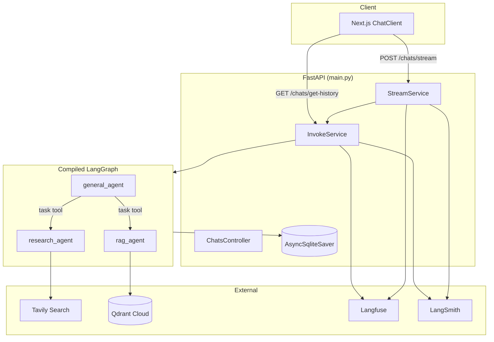
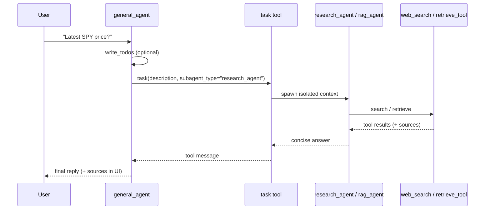
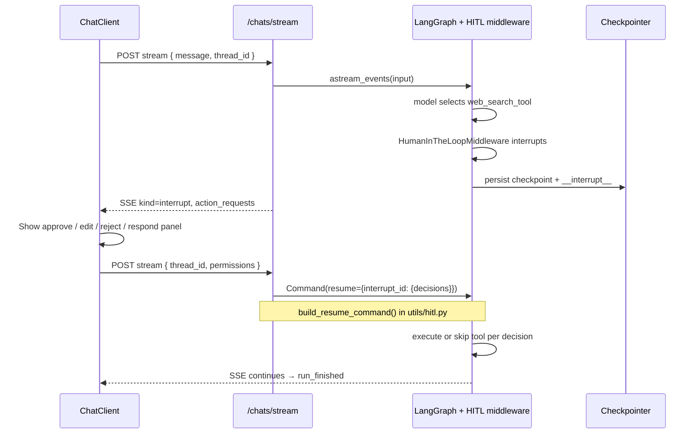
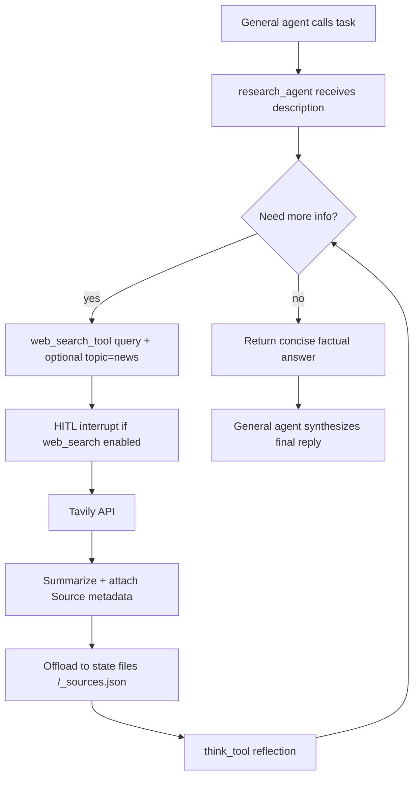
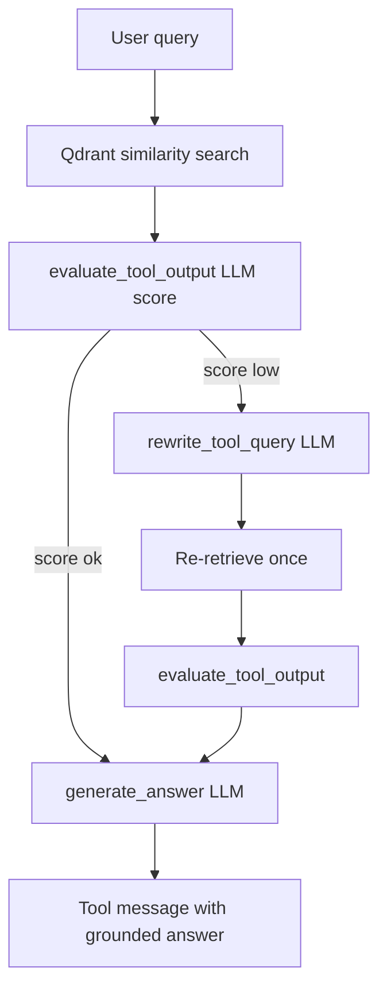
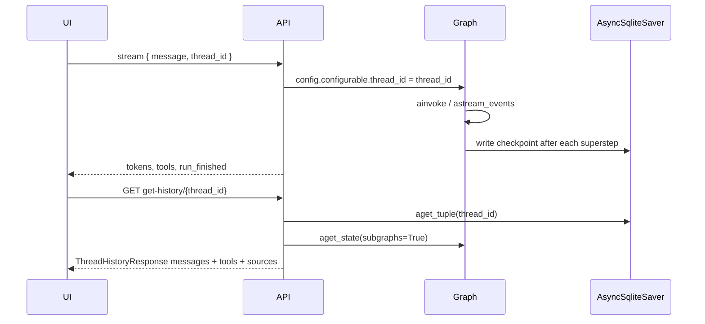

# Deep Agents — Technical Documentation

Production LangGraph **deep-agent** framework: multi-agent orchestration, human-in-the-loop (HITL) tool approval, agentic RAG over Qdrant Cloud, web research sub-agents, durable conversation history via LangGraph checkpointers, and dual observability with **Langfuse** and **LangSmith**.

This document is written for engineers and interviewers who want to understand what was built and how each feature works end-to-end.

---

## Table of contents

1. [System overview](#system-overview)
2. [Architecture](#architecture)
3. [Agent model](#agent-model)
4. [Middleware](#middleware)
5. [Human-in-the-loop (HITL)](#human-in-the-loop-hitl)
6. [Research agents](#research-agents)
7. [RAG (retrieval-augmented generation)](#rag-retrieval-augmented-generation)
8. [Checkpointing and conversation history](#checkpointing-and-conversation-history)
9. [Tracing: Langfuse and LangSmith](#tracing-langfuse-and-langsmith)
10. [Streaming (SSE)](#streaming-sse)
11. [Supporting production features](#supporting-production-features)
12. [API surface](#api-surface)
13. [Environment variables](#environment-variables)
14. [Interview summary (CV talking points)](#interview-summary-cv-talking-points)

---

## System overview

| Layer | Technology | Role |
|-------|------------|------|
| Orchestration | LangGraph + `deepagents` | Compiled agent graphs, sub-agent delegation, virtual filesystem |
| API | FastAPI (`main.py`) | REST + SSE endpoints under `/chats`, `/agents`, `/skills`, etc. |
| Frontend | Next.js (`frontend/`) | Streaming chat UI, HITL approval panel, thread history, voice input |
| Agent config DB | SQLite (`db/agent_store.py`) | Agents, system prompts, tools, skills persisted and seeded at startup |
| Checkpoint store | Async SQLite (`data/checkpoints.db`) | Thread-scoped graph state for multi-turn + HITL resume |
| Vector store | Qdrant Cloud (`qdrant_service.py`) | Document chunks for RAG |
| Web search | Tavily API | Live research with source offloading |
| Observability | Langfuse + LangSmith | Request spans, LLM/tool traces, session metadata |

**Default agent IDs** (seeded in `db/seed_agents.py`):

| ID | Name | Purpose |
|----|------|---------|
| 1001 | `research_agent` | Web search + reflection; leaf sub-agent |
| 1003 | `rag_agent` | Qdrant retrieval; leaf sub-agent |
| 1002 | `general_agent` | Orchestrator: todos, files, delegates to research + RAG, MCP tools |

---

## Architecture



**Compilation path** (`utils/compile_agent.py`):

1. Load `DeepAgent` spec from SQLite via `resolve_agent()`.
2. Recursively compile nested sub-agents (`utils/compile_subagents.py`).
3. Call `create_deep_agent()` with tools, `interrupt_on`, checkpointer, PII middleware, and optional Daytona-backed filesystem.
4. Cache compiled graphs per `agent_id` in `InvokeService`.

**Shared state** (`state.py`):

- `todos` — task list with `pending` / `in_progress` / `completed`
- `files` — virtual filesystem (context offloading) merged via `file_reducer`
- `messages` — standard LangGraph agent message history

---

## Agent model

### General agent (orchestrator)

The general agent is the default entry point (`GENERAL_AGENT_ID = 1002`). Its system prompt (`db/seed_agents.py`) combines:

- **TODO management** — plan and track work (`write_todos` / `read_todos`)
- **Virtual filesystem** — read/write files in agent state (and optionally Daytona sandbox)
- **Sub-agent delegation** — `task(description, subagent_type)` for research or RAG
- **PII guardrails** — email, credit card, IP, MAC redaction

It also mounts MCP tool groups: weather, math, and hotel booking.

### Sub-agent delegation workflow



**Design choices:**

- Sub-agents have **quarantined context** — they cannot see each other's work; the orchestrator must pass complete standalone task descriptions (`prompts/subagent_usage_instructions.py`).
- **Parallel delegation** — up to 3 concurrent `task` calls per iteration.
- **Tool arg repair** — `ToolCallArgsRepairMiddleware` fills missing `task` / `web_search_tool` args when models emit empty JSON (`utils/task_tool_args_repair.py`).

---

## Middleware

The standard execution flow for middleware is as follows:

**beforeAgent:** Runs once at the very beginning of the entire agent invocation. You could use this for initial setup, like loading the user's role or permissions.

**beforeModel:** Runs before the LLM is invoked for each step in the agent loop. This is useful for modifying the input prompt or state before the model processes it.

**wrapModelCall:** Wraps the actual call to the LLM. This allows you to intercept the request and response at a very low level.

**afterModel:** Runs immediately after the model generates a response but before any tools are called. This is the critical point for your RBAC check. At this stage, the model's decision (the `tool_calls`) is available, allowing you to inspect them and decide what to do (approve, reject, or request human approval for the tool call).

**afterAgent:** Runs once at the very end of the agent invocation, after all model calls and tool executions are complete. This can be used for cleanup or logging the final state.

---

## Human-in-the-loop (HITL)

### What it does

Certain tools require explicit human approval before execution. The graph **interrupts**, persists state in the checkpointer, and waits for the client to send a **resume** payload with per-tool decisions.

### Tool interrupt policy

Configured in `tools/default_interrupt_on.py` and passed to `create_deep_agent(interrupt_on=...)`:

| Tool | Interrupt? |
|------|------------|
| `web_search_tool` | **Yes** |
| `book-hotel` | **Yes** |
| `think_tool`, `read_todos`, `retrieve_tool`, weather, math, hotel search | No |

Per-agent overrides are supported via the `interrupt_on` field on `DeepAgent` specs.

### Technical workflow



### Backend implementation

| Module | Responsibility |
|--------|----------------|
| `utils/hitl.py` | `collect_pending_interrupts`, `collect_action_requests`, `build_resume_command`, decision mapping |
| `modules/chats/invoke_service.py` | `resolve_input_state()` — new message vs resume; `build_invoke_response()` — `awaiting_tool_permission` status |
| `modules/chats/stream_service.py` | Emits `kind: interrupt` SSE chunks with `action_requests` and `interrupt_ids` |
| `schemas/invoke_request.py` | `Permission` with `decision`: `approve` \| `edit` \| `reject` \| `respond` |

**Resume semantics:**

- Client sends `permissions` keyed by **tool name** (one decision applies to all pending requests with that name).
- `build_resume_command()` maps each permission to LangChain `ApproveDecision`, `EditDecision`, `RejectDecision`, or `RespondDecision`.
- Resume is keyed by **interrupt ID** (required for nested subgraph interrupts, e.g. research sub-agent inside `task`).
- Duplicate `(name, args)` action requests are collapsed for the UI; resume still expands one decision per pending request.

### Frontend

`frontend/src/components/ChatClient.tsx`:

- On `interrupt` chunk → render `HitlPanel` with approve / edit / reject / respond per tool.
- On submit → `POST /chats/stream` with same `thread_id` and `permissions` (no new user message).
- History reload (`GET /chats/get-history/{thread_id}`) restores pending interrupts if the user refreshes mid-approval.

### CLI helpers

- `permit.py` — non-streaming HITL loop for `POST /invoke`
- `permit_stream.py` — HITL loop over `POST /chats/stream`

---

## Research agents

### What it does

The **research_agent** (ID 1001) is a specialized sub-agent for **live, time-sensitive facts** via Tavily web search. It is invoked by the general agent through the `task` tool with `subagent_type="research_agent"`.

### Tools

| Tool | File | Purpose |
|------|------|---------|
| `web_search_tool` | `tools/web_search/web_search_tool.py` | Tavily search; summarizes results; offloads full content to virtual `/_sources.json` |
| `think_tool` | `tools/think/think_tool.py` | Strategic reflection between searches |

### Technical workflow



### Web search pipeline (`web_search_tool`)

1. **Search** — Tavily with configurable `topic`, `time_range` (default `year`), `max_results`.
2. **Content processing** — HTML → markdown, optional summarization (`utils/summarize.py`).
3. **Context offloading** — Large result bodies stored in agent `files`; tool message returns a short summary.
4. **Source tracking** — `Source` objects (title, URL, favicon, score) attached to tool messages and aggregated for the UI sources pill.
5. **HITL** — Execution pauses until user approves (if `interrupt_on[web_search_tool] == True`).

### Prompt engineering

`prompts/researcher_instructions.py` enforces:

- Short factual search queries (not full research briefs)
- `topic="news"` for live events
- Tool call budgets (1–5 searches by complexity)
- No inline citations in agent text (sources shown separately in UI)

---

## RAG (retrieval-augmented generation)

### What it does

The **rag_agent** (ID 1003) answers questions from **indexed documents** in Qdrant Cloud. The general agent delegates via `task(..., subagent_type="rag_agent")` when the user asks about content that may already be in the vector store.

### Indexing

| Component | Role |
|-----------|------|
| `qdrant_service.py` | **Active** RAG store: HuggingFace embeddings (`all-MiniLM-L6-v2` / `EMBEDDING_MODEL`), upsert/delete by `metadata.source`, LangChain retriever |
| `qdrant.py` | Qdrant Cloud bootstrap: `create_collection` (384-d Cosine) + `index_payload` for `metadata.source` / `metadata.file_id` |
| `chroma_service.py` | Legacy local Chroma implementation (kept; not used by retrieve/ingest paths) |
| `load_web_documents.py` | Indexes Lilian Weng blog URLs into Qdrant (demo corpus) |
| `RagPipeline` | Extract/chunk web, files, DB poll, CDC; load via `QdrantService.upsert_documents` |

**Qdrant Cloud setup** (collection + payload indexes; uses `QDRANT_*` from `.env`):

```bash
python qdrant.py
```

Run document indexing:

```bash
python load_web_documents.py
```

### Agentic RAG inside `retrieve_tool`

The RAG sub-agent exposes a single tool, `retrieve_tool` (`tools/rag/retrieve_tool.py`), which uses the shared **quality retry** loop (`utils/tool_quality_retry.py`) before generating an answer:



| Step | Module | Model / store |
|------|--------|---------------|
| Retrieve | `QdrantService.get_retriever()` | Qdrant Cloud + sentence-transformers (+ infra backoff) |
| Evaluate / rewrite | `utils/tool_quality_retry.py` | Score 0–1 vs query; rewrite if below threshold |
| Generate | `tools/rag/generate_answer.py` | Grounded answer from retrieved chunks |

`generate_answer` (and legacy `grade_documents` / `rewrite_query` prompts) remain in SQLite for the System Prompts admin UI. Retrieval quality control now goes through the shared helper so the same evaluate→rewrite→retry pattern can be reused by other tools.

### RAG agent prompt

`prompts/rag_agent_instructions.py` instructs the sub-agent to:

- Call `retrieve_tool` with a focused query
- Synthesize from returned context only
- Admit gaps when retrieval fails
- Limit to ≤2 `retrieve_tool` calls per task

`retrieve_tool` is **not** HITL-interrupted by default (`DEFAULT_INTERRUPT_ON`).

---

## Checkpointing and conversation history

### What it does

Every conversation turn is tied to a **`thread_id`**. LangGraph's checkpointer persists graph state (messages, todos, files, interrupt payloads) so users can:

- Continue multi-turn chats
- Resume after HITL approval
- Reload history after refresh
- Regenerate the last assistant reply (rewind)

### Checkpointer implementation

`utils/get_checkpointer.py` supports:

| Type | Use case |
|------|----------|
| `IN_MEMORY` | Tests / ephemeral |
| `ASYNC_SQLITE` | **Production default** — `data/checkpoints.db` |
| `ASYNC_POSTGRESQL` | Scalable deployment option |

**Startup** (`main.py` lifespan):

```python
await init_sqlite_checkpointer()  # process-wide singleton
```

Agents compile with `checkpointer=get_checkpointer(CheckpointerType.ASYNC_SQLITE)` unless overridden.

### Technical workflow: new message



### History reconstruction

`InvokeService.build_history_messages()` (`modules/chats/invoke_service.py`):

- Walks checkpoint `messages` (human / AI / tool)
- Rebuilds assistant bubbles with tool events, reasoning, and merged sources
- Loads web-search sources from virtual `/_sources.json` in `files` when present
- Returns `awaiting_tool_permission` + `action_requests` if interrupts are pending

### Thread lifecycle endpoints

| Endpoint | Behavior |
|----------|----------|
| `GET /chats/get-history/{thread_id}` | Load messages + HITL state |
| `POST /chats/rewind/{thread_id}` | Remove last user turn and everything after (for regenerate) |
| `DELETE /chats/delete-thread/{thread_id}` | Delete checkpoints + Daytona sandbox (blocked if awaiting permission) |

---

## Tracing: Langfuse and LangSmith

### What it does

Dual observability: **Langfuse** for product/session analytics and **LangSmith** for LangChain-native run trees. Both are optional and activated via environment variables.

### Initialization

`utils/tracing.py` — `init_tracing()` runs at import time in `main.py` (after `load_dotenv`):

- Syncs `LANGSMITH_TRACING` / `LANGCHAIN_TRACING_V2` flags
- Enables tracing only when API keys are present

### Per-agent-run tracing

Every graph invocation merges tracing into `RunnableConfig` via `with_tracing_config()` (`utils/langfuse_tracing.py`):

```python
config = with_tracing_config(config, thread_id=thread_id, agent_id=agent_id)
```

This attaches:

| Callback | When active |
|----------|-------------|
| `langfuse.langchain.CallbackHandler` | `LANGFUSE_PUBLIC_KEY` + `LANGFUSE_SECRET_KEY` set |
| `LangChainTracer` | `LANGSMITH_API_KEY` + tracing flags |

**Metadata** on each run:

- `langfuse_session_id` → `thread_id`
- `langfuse_tags` → `["agent_id:1002"]`
- `thread_id`, `agent_id`

### HTTP request tracing

`TracingMiddleware` wraps non-SSE HTTP requests:

- Creates one Langfuse span + one LangSmith run per request
- **Skips** `/chats/stream` (SSE must not be wrapped — streaming pass-through)
- Records method, path, query, status code; flushes Langfuse on completion/error

### Function-level spans

`@trace(name)` decorator composes Langfuse `@observe` and LangSmith `@traceable` — used in RAG helpers (e.g. `grade_documents`).

### What you can demo in an interview

- Full request → agent → tool → sub-agent tree in LangSmith
- Session-grouped traces in Langfuse keyed by `thread_id`
- Compare latency across `research_agent` vs `rag_agent` delegations

---

## Streaming (SSE)

### What it does

`POST /chats/stream` uses LangGraph `astream_events(version="v3")` and projects a unified SSE protocol for the Next.js client.

### Chunk kinds (`schemas/invoke_response.py`)

| Kind | Meaning |
|------|---------|
| `text` / `reasoning` | Token deltas from model |
| `tool_call_started` / `tool_call_finished` | Tool lifecycle + I/O |
| `subagent_started` / `subagent_finished` | Delegation boundaries |
| `system` | Transient status (thinking, planning, delegating) — shown inline on assistant bubble |
| `interrupt` | HITL pause |
| `message_finished` / `run_finished` | Turn complete; `run_finished` includes `reply` + `sources` |

`StreamService` (`modules/chats/stream_service.py`) merges parallel projections (messages, tool_calls, subagents, values/interrupts) and deduplicates system status lines per run.

### Cancel

`POST /chats/cancel-stream/{thread_id}` aborts the in-flight `AsyncGraphRunStream`.

---

## Supporting production features

### Virtual filesystem and context offloading

- Agent state `files` dict stores research notes, search dumps, and `/_sources.json`.
- `deepagents` `StateBackend` or **Daytona** sandbox (`utils/daytona_sandbox.py`) when `DAYTONA_SANDBOX_ENABLED=true`.
- Per-thread sandboxes; skills synced into `/skills/skill_<id>/SKILL.md`.

### Skills

- CRUD at `/skills`; agents reference `skill_ids` in SQLite.
- `sync_skills_for_thread()` loads skill markdown into the backend before each run.

### PII guardrails

- `PIIMiddleware` on input, output, and tool results (email, credit card, IP, MAC).
- `RedactedPIIResponseMiddleware` blocks assistant replies that treat `[REDACTED_*]` tokens as real data.

### MCP tools

Weather, math, and hotel tools are loaded via `langchain-mcp-adapters` and MCP servers under `mcp_servers/` (official `mcp.server.fastmcp`, not the separate `fastmcp` PyPI package — that package conflicts with `mcp` 1.x required by the adapters). Optional Bearer token forwarded from `Authorization` header through `mcp_access_token_context`.

### Tool-level retry with backoff

Transient tool failures (timeouts, connection errors, HTTP 429/5xx) are retried with exponential backoff via `utils/retry.py`:

- **Web search** — `run_tavily_search` retries transient network errors; permanent Tavily auth/quota errors fail immediately.
- **RAG retrieve** — Qdrant `retriever.invoke` is retried; empty/irrelevant docs use semantic quality retry (below).
- **MCP / hotel toolsets** — `resolve_tools` wraps weather, math, and hotel tools with `wrap_tool_with_retry` so both `create_deep_agent` and plain LangGraph `ToolNode` share the same behavior.
- **Plain LangGraph dummy** — `graphs/dummy_langgraph_agent.py` wraps its tools the same way.

Defaults (overridable): `TOOL_RETRY_MAX_ATTEMPTS=3`, `TOOL_RETRY_INITIAL_INTERVAL=0.5`, `TOOL_RETRY_BACKOFF_FACTOR=2.0`, `TOOL_RETRY_MAX_INTERVAL=8.0`.

### Tool output quality retry (evaluate → rewrite → retry)

Semantic quality failures (off-topic / empty / low usefulness) use `utils/tool_quality_retry.py`:

1. Run the tool with the current query
2. LLM-score the text output vs the user query (`evaluate_tool_output`)
3. If score &lt; `TOOL_QUALITY_MIN_SCORE` (default `0.6`), rewrite the query (`rewrite_tool_query`) and retry
4. Stop after `TOOL_QUALITY_MAX_RETRIES` rewrites (default `1` → 2 total attempts)

Wired into:

- **`retrieve_tool`** — replaces the old binary grade/rewrite loop with the shared scorer
- **`web_search_tool`** — evaluates search summaries before offloading files
- **MCP / hotel tools** — `wrap_tool_with_quality_retry` (no-ops when args have no query-like field such as `query` / `city` / `location`)
- **Plain LangGraph dummy** — same wrapper stack as deepagents MCP tools

This is separate from infrastructure backoff: backoff handles transport flakes; quality retry handles bad results.

### Speech-to-text

`POST /chats/speech-to-text` — AssemblyAI transcription for voice input in the chat UI.

### Admin UI

Next.js pages for **Agents**, **System Prompts**, and **Skills** CRUD (`frontend/src/components/CrudPage.tsx`).

---

## API surface

| Method | Path | Description |
|--------|------|-------------|
| `POST` | `/chats/invoke` | Single-turn invoke (JSON response) |
| `POST` | `/chats/stream` | SSE streaming (primary UI path) |
| `POST` | `/chats/cancel-stream/{thread_id}` | Abort stream |
| `GET` | `/chats/get-history/{thread_id}` | Checkpoint history |
| `POST` | `/chats/rewind/{thread_id}` | Regenerate support |
| `DELETE` | `/chats/delete-thread/{thread_id}` | Teardown thread |
| `POST` | `/chats/speech-to-text` | Audio → text |

Agent, skill, and system-prompt management under `/agents`, `/skills`, `/system-prompts`.

---

## Environment variables

```env
# Required for core functionality
TAVILY_API_KEY=...
ANTHROPIC_API_KEY=...   # or XAI_API_KEY for Grok default model
XAI_API_KEY=...

# Checkpointing (optional override)
SQLITE_CONN_STRING=./data/checkpoints.db

# LangSmith
LANGSMITH_API_KEY=...
LANGSMITH_TRACING=true
LANGCHAIN_TRACING_V2=true
LANGSMITH_PROJECT=deep-agents-from-scratch

# Langfuse
LANGFUSE_PUBLIC_KEY=...
LANGFUSE_SECRET_KEY=...
LANGFUSE_HOST=https://cloud.langfuse.com   # if self-hosted, set accordingly

# RAG
CHROMA_COLLECTION_NAME=...
EMBEDDING_MODEL=sentence-transformers/all-MiniLM-L6-v2
QDRANT_URL=https://....aws.cloud.qdrant.io
QDRANT_API_KEY=...
QDRANT_COLLECTION_NAME=deep_agents_rag

# Daytona sandbox (optional)
DAYTONA_SANDBOX_ENABLED=false
DAYTONA_API_KEY=...

# Tool-level retry / backoff (optional)
TOOL_RETRY_MAX_ATTEMPTS=3
TOOL_RETRY_INITIAL_INTERVAL=0.5
TOOL_RETRY_BACKOFF_FACTOR=2.0
TOOL_RETRY_MAX_INTERVAL=8.0

# Tool output quality retry (optional)
TOOL_QUALITY_MAX_RETRIES=1
TOOL_QUALITY_MIN_SCORE=0.6

# Speech
ASSEMBLYAI_API_KEY=...
```

---

## Quick start (for reviewers)

```bash
# Backend
python3 -m venv .venv && source .venv/bin/activate
pip install -r requirements.txt
cp .env.example .env   # fill keys
python load_web_documents.py   # optional: seed RAG corpus
python main.py

# Frontend
cd frontend && npm install && npm run dev
# Open http://127.0.0.1:5173/chats
```

**Suggested demo flows for interviews:**

1. **Research + HITL** — Ask a live factual question → approve `web_search_tool` → show sources pill and Langfuse session.
2. **RAG** — Ask about Lilian Weng blog topics (after indexing) → `rag_agent` → `retrieve_tool` quality-retry path.
3. **History** — Refresh page with `?threadId=...` → history restored from SQLite checkpoints.
4. **Tracing** — Open LangSmith/Langfuse while running a multi-step delegation trace.

---

## Key source files (cheat sheet)

| Feature | Primary files |
|---------|---------------|
| HITL | `utils/hitl.py`, `tools/default_interrupt_on.py`, `frontend/src/components/ChatClient.tsx` |
| Research | `agents/` (seed), `tools/web_search/`, `prompts/researcher_instructions.py` |
| RAG | `qdrant_service.py`, `qdrant.py`, `chroma_service.py` (legacy), `tools/rag/`, `load_web_documents.py` |
| Checkpointer | `utils/get_checkpointer.py`, `main.py` (lifespan), `modules/chats/invoke_service.py` |
| Tracing | `utils/tracing.py`, `utils/langfuse_tracing.py` |
| Streaming | `modules/chats/stream_service.py`, `schemas/invoke_response.py` |
| Compilation | `utils/compile_agent.py`, `utils/compile_subagents.py` |

---

## Interview summary (CV talking points)

Point-form walkthrough of each feature — use these steps when explaining the system in interviews.

### System overview

- Built a production multi-agent stack: LangGraph orchestration, FastAPI API, Next.js chat UI.
- Persisted agent config in SQLite; conversation state in LangGraph checkpointers; RAG corpus in Qdrant Cloud.
- Wired dual observability (Langfuse + LangSmith) and Tavily for live web research.
- Seeded three agents: `general_agent` (orchestrator), `research_agent` (web), `rag_agent` (vector DB).

### Architecture

- Frontend posts to FastAPI; chats resolve to a compiled LangGraph via `InvokeService` / `StreamService`.
- Compilation: load agent from SQLite → recursively compile sub-agents → `create_deep_agent()` with tools, HITL, PII middleware, checkpointer → cache by `agent_id`.
- Shared graph state: `messages`, `todos`, and virtual `files` (context offloading via `file_reducer`).
- Orchestrator delegates to leaf agents through the `task` tool; leaves call Tavily or Qdrant and return results.

### Agent model

- General agent system prompt combines TODOs, virtual filesystem, sub-agent delegation rules, and PII guardrails.
- Mounted MCP tool groups (weather, math, hotel) on the orchestrator.
- Delegation: orchestrator calls `task(description, subagent_type)` → isolated sub-agent context → tool use → concise answer back to orchestrator.
- Design: quarantined sub-agent context, up to 3 parallel `task` calls, middleware to repair empty tool-call args from the LLM.

### Middleware

- Hook order: `beforeAgent` → (`beforeModel` → `wrapModelCall` → `afterModel` → tools)* → `afterAgent`.
- `beforeAgent` / `afterAgent`: once per invocation (setup / cleanup).
- `beforeModel` / `wrapModelCall` / `afterModel`: each model step; `afterModel` is where RBAC / HITL inspects `tool_calls` before tools run.

### Human-in-the-loop (HITL)

**Backend**

- Mark sensitive tools in `DEFAULT_INTERRUPT_ON` (e.g. `web_search_tool`, `book-hotel`); pass `interrupt_on` into `create_deep_agent`.
- Model selects a tool → `HumanInTheLoopMiddleware` interrupts → checkpointer stores `__interrupt__` + pending action requests.
- Stream emits SSE `kind: interrupt` with `action_requests` / interrupt IDs.
- Client resumes with `permissions` (approve / edit / reject / respond) on the same `thread_id`.
- `build_resume_command()` maps permissions → LangChain decisions keyed by interrupt ID (supports nested subgraph interrupts).
- Graph continues: execute or skip tools per decision; stream finishes normally.

**Frontend**

- `ChatClient` receives interrupt chunk → renders HITL panel (approve / edit / reject / respond per tool).
- User submits → `POST /chats/stream` with `permissions` only (no new user message).
- History reload restores pending interrupts if the user refreshes mid-approval.
- CLI helpers (`permit.py`, `permit_stream.py`) exercise the same loop without the UI.

### Research agents

- General agent routes live/time-sensitive questions to `research_agent` via `task`.
- Research agent loops: `web_search_tool` → optional HITL → Tavily → summarize → offload full results to `/_sources.json` → `think_tool` → more searches or final answer.
- Pipeline: search → HTML/markdown processing → context offloading → `Source` metadata for the UI sources pill.
- Prompt rules: short search queries, `topic=news` for live events, search budgets, no inline citations (sources shown in UI).

### RAG (retrieval-augmented generation)

- Index docs with `QdrantService`: HuggingFace embeddings, chunk/split, upsert to Qdrant Cloud (web URLs, PDF, DOCX, etc.). `chroma_service.py` remains as a legacy local option.
- General agent routes vector-DB questions to `rag_agent` via `task`.
- Short vector-DB lookups skip `write_file` / todos and delegate immediately; arg-repair rewrites filesystem-only tool calls to `task(rag_agent)` and no longer drops empty `task` calls when the current user turn is unanswered.
- `retrieve_tool` runs agentic RAG: retrieve → evaluate output quality → rewrite query + re-retrieve once if needed → generate grounded answer.
- Shared `utils/tool_quality_retry.py` powers quality retry for retrieve, web search, and query-like MCP tools.
- Generate (and legacy grade/rewrite) prompts live in SQLite and are editable via the System Prompts admin UI.
- RAG helpers use a smaller model; orchestration agents use a stronger model for reliable tool args.

### Checkpointing and conversation history

- Every turn scoped by `thread_id`; `AsyncSqliteSaver` persists messages, todos, files, and HITL payloads after each superstep.
- Startup initializes a process-wide SQLite checkpointer; agents compile with it attached.
- New message: stream with `thread_id` → graph writes checkpoints → client can `GET /chats/get-history/{thread_id}`.
- History rebuild: walk checkpoint messages → reconstruct bubbles with tools, reasoning, sources, and pending interrupts.
- Lifecycle: rewind last turn (regenerate), delete thread (checkpoints + optional Daytona sandbox), block delete while awaiting HITL.

### Tracing: Langfuse and LangSmith

- `init_tracing()` at app import; enabled only when API keys / flags are set.
- Each graph run: `with_tracing_config()` attaches Langfuse callback + LangSmith auto-tracing with `thread_id` / `agent_id` metadata.
- HTTP middleware wraps non-SSE requests into request-level spans; SSE stream path is excluded so streaming is not buffered.
- `@trace` decorator on RAG helpers (grade, rewrite, generate) for function-level spans.
- Demo story: full agent→tool→sub-agent tree in LangSmith; session-grouped traces in Langfuse by `thread_id`.

### Streaming (SSE)

- `POST /chats/stream` uses LangGraph `astream_events(v3)` and projects a typed SSE protocol.
- Chunk kinds: text/reasoning deltas, tool start/finish, subagent boundaries, system status, interrupt, message/run finished (with reply + sources).
- `StreamService` merges parallel event streams and deduplicates status lines.
- Cancel endpoint aborts the in-flight async stream by `thread_id`.

### Supporting production features

- Virtual filesystem / context offloading in state `files`; optional Daytona sandbox per thread when enabled.
- Skills CRUD + sync skill markdown into the agent backend before each run.
- PII middleware redacts email/CC/IP/MAC on input, output, and tool results; blocks treating redaction tokens as real data.
- MCP adapters load weather/math/hotel tools; optional Bearer token forwarded into MCP context.
- Tool-level exponential backoff (`utils/retry.py`) on transient Tavily/Qdrant/MCP failures; permanent errors fail fast.
- Tool output quality retry (`utils/tool_quality_retry.py`): evaluate score → rewrite query → retry up to a max count.
- Speech-to-text via AssemblyAI for voice input; admin UI for agents, prompts, and skills.

### API surface

- Chat: invoke, stream, cancel, get-history, rewind, delete-thread, speech-to-text.
- Admin: agents, skills, system-prompts CRUD under matching route prefixes.

### Environment variables / quick start

- Required keys: Tavily, Anthropic and/or xAI; optional LangSmith, Langfuse, Qdrant (`QDRANT_*`), Daytona, AssemblyAI.
- Local demo path: venv + requirements → seed RAG corpus → run `main.py` → Next.js frontend → interview flows (HITL research, RAG, history restore, tracing).
